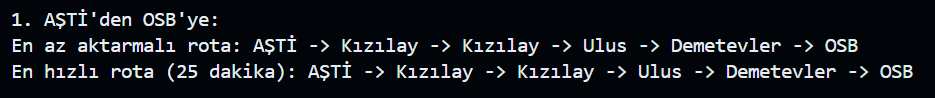
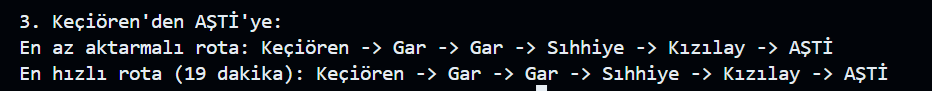
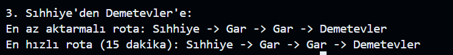

**Sürücüsüz Metro Simülasyonu (Rota Optimizasyonu)**

**A. ÖZET**

Bu proje, bir metro ağı modellemesi yaparak, farklı istasyonlar
arasındaki en az aktarmalı ve en hızlı rotaları bulan bir Python
uygulamasıdır. BFS algoritması en az aktarmalı rotaları bulmak için, A\*
algoritması ise en hızlı rotaları bulmak için kullanılır. Metro ağına
istasyonlar eklenip bağlantılar kurulurken, her istasyonun aktarma
noktaları ve bağlantı süreleri dikkate alınır. Uygulama, kullanıcıların
başlangıç ve hedef istasyonları arasında en uygun güzergahı bulmalarına
yardımcı olur. Her iki algoritma da rotaları optimize ederek, karmaşık
toplu taşıma ağlarında verimli bir yolculuk planlaması sağlar.

**Projede Kullanılan Teknolojiler ve Kütüphaneler**

**A. Kullanılan Teknolojiler**

1\. [Python 3.12.2]{.underline}

2\. [VS Code (Visual Studio Code)]{.underline}

3\. [Nesne Yönelimli Programlama (OOP)]{.underline}

**B. Kullanılan Modüller ve Fonksiyonlar**

1\. [collections]{.underline} modülü, standart veri yapılarına (list,
tuple, dict, set) alternatif olarak gelişmiş veri yapıları sağlar. Bu
projede deque (double-ended queue) ve defaultdict veri yapılarını
kullandık.

-   [deque (double-ended queue]{.underline}), list veri yapısına benzer
    ancak ondan çok daha işlevseldir. Hem başa hem de sona ekleme ve
    silme işlemlerini çok daha hızlı gerçekleştirir. Çift uçlu kuyruk
    yapısına sahip olduğu için BFS (Genişlik Öncelikli Arama)
    algoritmasıyla birlikte kullanım için idealdir. Projemizde de, deque
    veri yapısını kullanarak istasyonlar arasındaki en kısa bağlantı
    yolunu bulduk.

-   [defaultdict]{.underline} veri yapısı, normal dict ile benzer
    şekilde çalışır ancak olmayan bir anahtara erişildiğinde hata vermek
    yerine otomatik olarak varsayılan bir değer oluşturur. Projede
    hatlar sözlüğü defaultdict(list) olarak tanımlanarak, yeni bir hat
    eklenirken önce manuel olarak liste oluşturma gerekliliği ortadan
    kaldırılmış ve doğrudan istasyon eklenmesi sağlanmıştır. Bu sayede,
    hatlar sözlüğüne ekleme yaparken hata alma riski ortadan kalkmıştır.

2\. [heapq]{.underline} modülü, Python'da öncelik kuyruğu (priority
queue) işlemleri için kullanılan bir veri yapısı sağlar. Min-heap
mantığına dayanan bu yapı, tam bir ikili ağaç (complete binary tree)
şeklinde düzenlenmiştir ve her düğümün değeri, ebeveyninden büyük
olamaz. Bu özellik sayesinde, her zaman en küçük değer en üstte (kök
düğümde) bulunur ve işlem önceliği düşük olan elemanlar sona kalır. Bu
projede heapq, en hızlı rotayı bulmak amacıyla kullanılmıştır.
Algoritma, her adımda süre bakımından en kısa olan istasyonu seçerek
işleme devam eder. Böylece, gereksiz hesaplamalar engellenir, öncelikli
yollar hızlıca değerlendirilir ve algoritmanın verimliliği artırılır. Bu
işlemleri gerçekleştirirken modülden heappop(), heappush() fonksiyonları
kullandık.

-   [heappush(heap, item)]{.underline}, bir öğeyi heap'e eklemek için
    kullanılır. Öğeyi eklerken heap yapısını korur, yani öğeler sıralı
    bir şekilde tutulur.

-   [heappop(heap)]{.underline}, heap'ten en küçük öğeyi çıkarır ve
    döndürür. Bu işlemden sonra heap yapısını yeniden düzenler.

3\. [typing]{.underline} modülü, type hinting (tip ipucu) eklemek için
kullanılan bir modüldür. Python'da değişkenlerin türünü belirtmeye gerek
yoktur, ancak daha okunaklı ve hatasız kod yazmak için typing modülü
kullanılabilir. Böylece veri yapısını takip etmek kolaylaştığından hata
oranı azalır.

-   Dict\[K, V\] yapısı, anahtar-değer saklayan sözlük oluşturulur.

-   Set\[T\] yapısı, tekrarsız elemanlardan oluşan küme oluşturulur.

-   List\[T\] yapısı, belirli türde öğelerden oluşan liste oluşturulur.

-   Tuple\[T1, T2, \...\] yapısı, sabit uzunlukta, farklı türde veri
    içeren tuple oluşturulur.

-   Optional\[T\] yapısı, T türünde bir değer veya None olabilir.

**Algoritmaların Çalışma Mantığı**

**1. BFS (Breadth First Search)**

BFS, en az aktarmalı rotayı bulmak amacıyla kullanılan bir algoritmadır.
Bu algoritmanın temel mantığı, başlangıç noktasından hedef istasyona
doğru genişleyerek ilerlemektir. BFS, tüm komşu istasyonları keşfederek,
her bir istasyonun ulaşılabilirliğini katmanlar halinde değerlendirir.
Bu şekilde, ilk ulaşılan hedef, en az aktarmalı yol olacaktır. BFS, aynı
süreli geçişlerde her bir adımda aynı önceliği taşıyan komşuları
keşfederek rotayı belirler. Aktarmalarla sınırlı bir rota arayışı için
son derece uygun bir seçimdir, çünkü her yeni aktarma noktasına geçiş,
önceki adımlardan bağımsız olarak işlenir.

Projede, en az aktarmalı yol arayışında BFS kullanılmıştır, çünkü bu
algoritma, istasyonlar arasındaki geçiş sürelerinin eşit olduğu veya çok
yakın olduğu senaryolarda ilk bulunan yolu en kısa yol olarak kabul
eder. Bu durum, belirli istasyonlar arasındaki minimum aktarma sayısını
belirlemede garanti sağlar.

**2. A\* Algoritması**

A\* algoritması ise en hızlı rotayı bulma amacıyla kullanılan bir
algoritmadır. Bu algoritma, her adımda hem mevcut maliyeti (yolculuk
süresi) hem de gelecekteki maliyetleri (sezgisel tahmin) dikkate alır.
A\* algoritması, komşu istasyonlara geçişleri en düşük toplam maliyeti
(yani süreyi) hedef alarak işler ve böylece gereksiz yolları eleyerek
daha verimli bir çözüm sunar. Bu algoritma, dinamik ve değişken süreli
geçişler ile başa çıkmada özellikle güçlüdür, çünkü geçiş sürelerini ve
hedefe olan mesafeyi göz önünde bulundurarak en iyi rotayı seçer.

Projede, farklı geçiş süreleri olan rotalarda A algoritması
kullanılmıştır\*. Örneğin, istasyonlar arasındaki süreler farklı
olduğunda, A algoritması rotaları daha hassas bir şekilde
değerlendirir\* ve hedefe ulaşmak için en hızlı yolu önceliklendirir. Bu
sayede, hem kısa sürede hedefe ulaşma garantisi sağlar hem de en verimli
rotayı ortaya koyar.

**Örnek Kullanım ve Test Sonuçları**

Bu metro simülasyonu projesinde, kullanıcılar belirli istasyonlardan
diğerlerine en hızlı veya en az aktarma ile ulaşım sağlayacak rotaları
bulabilirler. Örnek test senaryoları, modelin doğruluğunu kontrol etmek
için farklı hatlar ve aktarma noktaları arasında gerçekleştirilmiştir.

Örneğin bize verilen örnek çıktıya göre:

-   AŞTİ'den OSB'ye ulaşım için en az aktarma gerektiren rota bulunarak
    Kızılay üzerinden geçiş yapılmıştır. Ayrıca, en hızlı rota
    hesaplandığında toplam süre de 25 dakika olarak belirlenmiştir.

> Çıktı:
>
> {width="6.298611111111111in"
> height="0.6597222222222222in"}

-   Batıkent'ten Keçiören'e ulaşım için farklı güzergâhlar incelenerek
    aktarmasız veya en az aktarma ile gidilebilecek rotalar test
    edilmiştir.

> Çıktı:
>
> {width="6.298611111111111in"
> height="0.7013888888888888in"}

-   Keçiören'den AŞTİ'ye ulaşım için alternatif rotalar hesaplanmış ve
    en kısa sürede ulaşım sağlayan yol belirlenmiştir.

> Çıktı:
>
> {width="6.298611111111111in"
> height="0.6180555555555556in"}

Ayrıca kendimiz seçtiğimiz başlangıç ve varış noktalarına göre:

-   Sıhhiye'den Demetevler'e ulaşmak için en az aktarma gerektiren rota
    için Gar istasyonundan geçiş yapılmıştır. En hızlı rota
    hesaplandığında toplam süre de 15 dakika olarak bulunmuştur.

> Çıktı:
>
> {width="5.173611111111111in"
> height="0.6319444444444444in"}

-   Ulus'tan Batıkent'e ulaşmak için en az aktarmalı rota için
    Demetevler istasyonundan geçiş yapılır ve toplam süre 16 dakika
    olarak hesaplanmıştır.

> Çıktı:
>
> {width="6.180555555555555in"
> height="0.6736111111111112in"}

Bu testlerin sonucunda, metro ağı modelinin doğru çalıştığı ve en uygun
güzergâhları belirleyebildiği gözlemlenmiştir.

**Projeyi Geliştirme Fikirleri**

**1. Veri Setleriyle Zenginleştirme ve Daha Gerçekçi Sonuçlar**

Şu anda metro ağı sabit istasyonlar ve bağlantılar kullanılarak
oluşturuluyor. Ancak, gerçek metro hatlarına ait veriler kullanılarak
model daha doğru hale getirilebilir.

-   Gerçek metro istasyonları ve hatlarını içeren bir veri seti
    oluşturulabilir.

-   API entegrasyonu yapılarak, resmi metro verileri sürekli
    güncellenebilir. Örneğin, İstanbul Büyükşehir Belediyesi'nin açık
    veri platformundan gerçek zamanlı veriler alınabilir.

**2. Zaman Bazlı Dinamik Hesaplama**

Metro sistemlerinde yoğun saatlerde daha fazla bekleme süresi olabilir.
Şu anki sistem sabit seyahat süreleriyle çalışıyor, ancak zaman bazlı
bir model geliştirilerek daha gerçekçi tahminler yapılabilir.

-   Yoğun saatlerde (07:00 - 09:00 ve 17:00 - 19:00) bekleme süreleri
    artırılabilir.

-   Metro hatlarına göre hızlı hatlar veya yavaş hatlar belirlenerek
    alternatif güzergâhlar önerilebilir.

-   Kullanıcı, belirli bir saat için en uygun güzergâhı görmek
    istediğinde, trafik durumuna bağlı olarak dinamik süre hesaplaması
    yapılabilir.

**3. Farklı Ulaşım Türleriyle Entegrasyon**

Sadece metro değil, otobüs, tramvay ve vapur gibi farklı ulaşım türleri
de hesaba katılarak kapsamlı bir ulaşım planlayıcısı geliştirilebilir.

-   Otobüs, tramvay ve vapur hatları veri tabanına eklenerek alternatif
    rotalar oluşturulabilir.

-   Kullanıcı "Metro + Otobüs" veya "Metro + Vapur" gibi seçenekler
    sunan bir sistemle en iyi ulaşım yolunu seçebilir.

-   Google Maps API veya belediyelerin toplu taşıma verileri
    kullanılarak, duraklar arası tahmini süreler hesaplanabilir.

-   Kullanıcı A noktasından B noktasına gitmek istediğinde, en iyi
    güzergâh metro + otobüs kombinasyonu olabilir.

**KAYNAKÇA**

1.  <https://docs.python.org/tr/3.13/library/collections.html#module-collections>

2.  <https://docs.python.org/tr/3.13/library/collections.html#collections.defaultdict>

3.  <https://docs.python.org/tr/3.13/library/collections.html#collections.deque>

4.  <https://docs.python.org/tr/3.13/library/heapq.html>

5.  [https://docs.python.org/3/tutorial/datastructures.html#](https://docs.python.org/3/tutorial/datastructures.html)

6.  <https://medium.com/@moraneus/exploring-the-power-of-pythons-typing-library-ff32cec44981>
